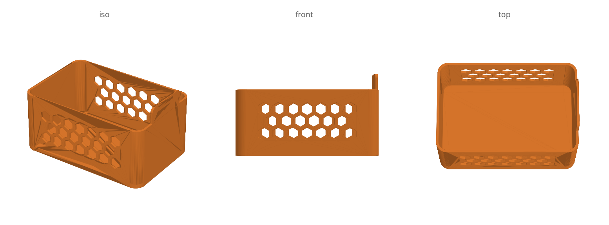
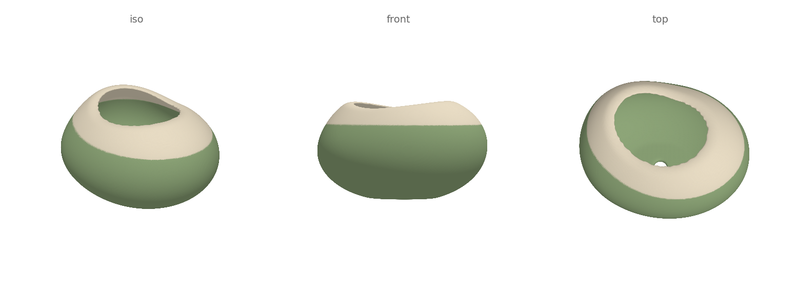

# solidsmith

[](https://github.com/scottshamansky/solidsmith/actions/workflows/ci.yml)
[](LICENSE)


**Forge watertight, print-ready 3D parts from Python.**

solidsmith is the missing glue between [trimesh](https://trimesh.org) and your
printer: booleans that don't fall over, 3MF export that keeps its colors, a
printability report, and quick multi-view renders to iterate against — the
scaffolding every scripted-CAD project ends up reinventing, packaged once.



## Why script your models?

Parametric code beats mouse-driven CAD when you make things repeatedly:

- **Every dimension is a variable.** Resize a bin, thicken a wall, or regenerate
  a whole family of sizes by editing constants, not dragging faces.
- **Geometry you authored is geometry you own.** Marketplaces increasingly
  require sellers of printed goods to use their own original designs. A model
  built from your own code is original by construction, and generic patterns
  (honeycombs, gears, chamfers) stay free for everyone.
- **Designs diff, review, and version like any other code.**

## What trimesh leaves to you (and solidsmith does)

| Pain | What solidsmith does |
| --- | --- |
| Booleans fail on real-world meshes | `union` / `difference` / `intersection` run the robust manifold engine with mesh hygiene (`clean`) before and after |
| 3MF export silently drops color | `write_3mf` injects real `<basematerials>` and tags each body, so multi-color models open in the slicer with filaments already assigned |
| "Will it print?" found out the hard way | `check` reports watertightness per body, bed fit, plate contact, walls too thin for the nozzle, and stray debris bodies — against a named printer profile (`printer="bambu_a1_mini"`) or your own `Printer` |
| Seeing your part means opening a slicer | `render_views` renders shaded PNGs from named camera angles in about a second, no GUI or GPU |

## Quickstart

```python
from solidsmith import Part, check, difference, rounded_prism, render_views, write_3mf

shell = rounded_prism((80, 50, 30), radius=8)
cavity = rounded_prism((74, 44, 30), radius=5)
cavity.apply_translation((0, 0, 3))
tray = difference(shell, cavity)

print(check(tray))                     # watertight? fits the bed? on the plate?
write_3mf(Part(tray, color=(226, 122, 40), name="tray"), "tray.3mf")
render_views(tray, "tray.png")         # shaded views, one PNG
```

```
✔ watertight (1 body)
✔ 80.0 × 50.0 × 30.0 mm on a 256 × 256 × 256 bed (Bambu X1C / P1S)
✔ first layer on the plate (z=0)
  31.0 cm³ · 564 triangles
```

Multi-color is just more `Part`s — one per filament — exported together:

```python
write_3mf([Part(body, (30, 120, 220), "body"),
           Part(cap,  (240, 200, 40), "cap")], "model.3mf")
```

## Examples

| Model | Run it |
| --- | --- |
| Honeycomb storage bin — vented walls, supports-free label tab, every dimension a parameter | `python examples/honeycomb_bin.py` |
| Pebble planter — SDF-sculpted organic form, hollow with a drainage hole, split into two filament colors | `python examples/pebble_planter.py` |
| Hex bit organizer — 16 slide-fit sockets for 1/4" bits, built on `workflow.main` with preview/final modes | `python examples/bit_organizer.py preview` |



Each example writes STL + colored 3MF + a rendered preview into `out/` and
prints its printability report. Add `--fast` while you iterate.

## Install

```bash
git clone https://github.com/scottshamansky/solidsmith
cd solidsmith
pip install -e .
```

Requires Python 3.9+. Dimensions are millimeters throughout; the default bed
is a 256 mm cube (Bambu P1/P2/X1 class) and every check takes your own `bed=`.

## Sculpting (SDF)

Alongside the hard-edged boolean toolkit, `solidsmith.sdf` models organic
shapes as blended signed distance fields — functional primitives, smooth
unions that read as clay fillets, `offset`/`shell` for hollowing, and
marching-cubes meshing with Taubin smoothing:

```python
from solidsmith import sdf

body = sdf.smooth_union(12, sdf.sphere((0, 0, 30), 25),
                            sdf.ellipsoid((0, 18, 22), (20, 26, 16)))
solid = sdf.intersect(body, sdf.plane())          # flat print base at z=0
mesh = sdf.mesh(solid, bounds=((-30, -30, 0), (30, 50, 50)), pitch=0.5)
```

## The iteration loop

`workflow.main` wraps the loop every scripted model settles into: `preview`
builds coarse and renders a PNG in seconds; `final` cuts the print-quality
files; and every preview is archived to `previews/` — script included — so
each iteration's look and the code that produced it stay side by side.

```python
from solidsmith import workflow

def build(fast: bool):
    ...
    return parts        # a mesh, a Part, or a list of them

if __name__ == "__main__":
    workflow.main(build, name="widget")
```

`python widget.py preview`, tweak, repeat — `python widget.py final` once
the design is locked.

## Roadmap

- More examples and an overhang/support-need check
- PyPI release

## License

[MIT](LICENSE)
